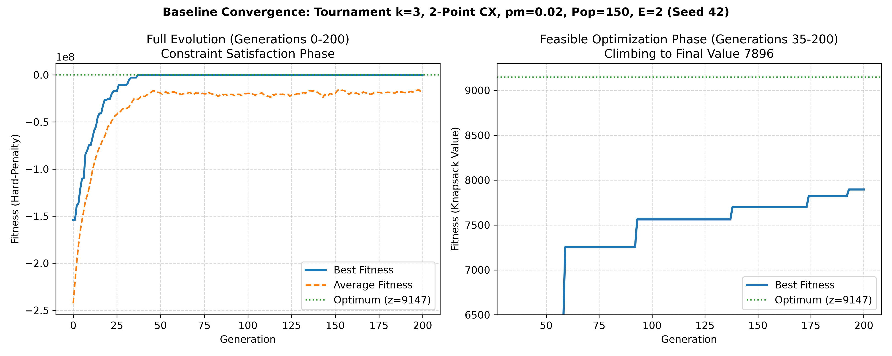

# SE3062 Intelligent Systems
## Practical 06 – Genetic Algorithms for 0/1 Knapsack

**Student Name:**  
**Student ID:**  
**Date:** September 2026  

---

### 1. Problem & Dataset

The 0/1 Knapsack Problem is an NP-hard combinatorial optimization task where $n$ items, each with profit $v_i$ and weight $w_i$, must be selected via binary decisions $x_i \in \{0, 1\}$ to maximize total profit $\sum v_i x_i$ subject to capacity constraint $\sum w_i x_i \le C$. We evaluate using the official David Pisinger benchmark instance `knapPI_1_100_1000_1` ($n=100$, knapsack capacity $C=995$, and known global optimum $z=9147$ with optimal weight $W=985 \le 995$, consisting of 12 selected items). The known optimum is reserved strictly for post-run optimality gap verification and is not exposed to the genetic algorithm.

---

### 2. GA Design

The algorithm is implemented in Python with DEAP using a 100-bit chromosome representation ($1 = \text{selected}$, $0 = \text{excluded}$). Infeasible solutions exceeding capacity $C$ are penalized using the quadratic-order hard-penalty objective: $\text{Fitness}(\mathbf{x}) = \sum v_i x_i - M \cdot \max(0, \sum w_i x_i - C)$, where $M = 10 \times \max(v) = 9970$. Real elitism ($E=2$) is strictly enforced each generation by cloning the two fittest individuals directly into the next population, with the remaining $N-E=148$ individuals produced via parent selection, crossover, and mutation.

| Parameter | Specification / Value | Description |
| :--- | :--- | :--- |
| **Representation** | Binary List ($n=100$) | 100 alleles initialized with $U(0, 1)$ |
| **Population Size ($N$)** | 150 | Number of individuals per generation |
| **Generations ($G$)** | 200 | Total generational cycles per run |
| **Selection** | Tournament ($k=3$) | Parent selection operator (k=2, 4, Rank, Shifted Roulette in experiments) |
| **Crossover** | Two-Point Crossover | Two cut points swapped; probability $p_c = 0.90$ |
| **Mutation** | Bit-Flip Mutation | Independent bit-flip per gene; per-gene rate $p_m = 0.02$ |
| **Elitism ($E$)** | Real Elitism ($E=2$) | Top 2 chromosomes preserved unchanged without mutation |
| **Penalty Multiplier ($M$)**| Hard Penalty ($M=9970$) | $M = 10 \times \max(values)$; heavily penalizes overweight solutions |
| **Evaluation Seeds** | 5 Independent Replications | Random seeds: `42, 43, 44, 45, 46` |

---

### 3. Results

All 50 experimental runs (10 configurations $\times$ 5 seeds) were executed deterministically. The baseline median final best fitness across its 5 runs is **8817.00**.

#### Baseline Convergence (Seed 42)

*Figure 1: Baseline convergence under Seed 42. Left: Full evolution over generations 0–200 demonstrating escape from initial severe hard-penalty violations ($-2.4 \times 10^8$). Right: Zoomed view of feasible optimization (generations 35–200) climbing to a feasible value of 7896 (weight 994).*

#### Experimental Results Summary Table

| Configuration | Varied Factor | Best Fitness (Mean ± SD) | Median Fit | Feasible Value | Gap (%) | Gen to Base Median (8817.0) |
| :--- | :--- | :---: | :---: | :---: | :---: | :---: |
| **Baseline** | $k=3$, 2-pt, $p_m=0.02$ | 8666.0 ± 468.9 | 8817.0 | 8666.0 | 5.26% | 181.7 (3/5 reached) |
| **Tournament $k=2$** | Selection size $k=2$ | 7466.6 ± 1105.9 | 7328.0 | 7466.6 | 18.37% | None reached (>200) |
| **Tournament $k=4$** | Selection size $k=4$ | 8716.4 ± 264.0 | 8897.0 | 8716.4 | 4.71% | 83.7 (3/5 reached) |
| **Shifted Roulette** | Proportional selection | 5620.4 ± 992.4 | 5457.0 | 5620.4 | 38.55% | None reached (>200) |
| **Linear Rank** | Rank-based selection | 7418.6 ± 937.5 | 7525.0 | 7418.6 | 18.90% | None reached (>200) |
| **1-Point Crossover** | Single cut point | 8273.2 ± 612.3 | 8333.0 | 8273.2 | 9.55% | 168.0 (1/5 reached) |
| **Uniform Crossover**| Uniform swap ($p=0.5$) | 8563.6 ± 245.2 | 8575.0 | 8563.6 | 6.38% | 116.0 (1/5 reached) |
| **Mutation $p_m=0.01$**| Per-gene rate $p_m=0.01$ | **9054.0 ± 127.8** | **9147.0** | **9054.0** | **1.02%** | **69.6 (5/5 reached)** |
| **Mutation $p_m=0.05$**| Per-gene rate $p_m=0.05$ | $-11.3\text{M} \pm 2.26\text{M}$ | $-12.4\text{M}$ | 0.0 | 100.00% | None reached (>200) |
| **Mutation $p_m=0.10$**| Per-gene rate $p_m=0.10$ | $-44.4\text{M} \pm 9.82\text{M}$ | $-49.5\text{M}$ | 0.0 | 100.00% | None reached (>200) |

*Note: In the baseline configuration, Seed 46 discovered the exact global optimum (9147, weight 985). In configuration $p_m=0.01$, 3 out of 5 seeds (42, 44, 45) discovered the exact global optimum (9147).*

---

### 4. Discussion

**Selection Pressure**: Increasing tournament size from $k=2$ to $k=4$ systematically raised selection pressure, accelerating constraint satisfaction and improving final solution quality from 7466.6 ($k=2$) to 8666.0 ($k=3$) and 8716.4 ($k=4$). Tournament $k=4$ achieved the fastest convergence to the baseline median (mean 83.7 generations). Conversely, Linear Rank selection provided moderate pressure (7418.6), while Shifted Roulette performed poorly (5620.4, 38.55% gap). Because the hard penalty required shifting fitnesses by $\sim 1.7 \times 10^8$ to eliminate negative values, relative selection weights between high- and low-performing individuals were severely flattened, reducing roulette selection to an ineffective near-random drift.

**Crossover Operators**: Two-point crossover (baseline) achieved the highest solution quality (8666.0 ± 468.9), striking an effective balance between building block disruption and recombination. Uniform crossover ($p_{swap}=0.5$) converged rapidly in early feasible generations due to aggressive mixing (reaching 8563.6 ± 245.2, gap 6.38%), but its high schema disruption prevented the fine preservation of tightly packed item subsets in late generations. One-point crossover yielded the lowest quality (8273.2 ± 612.3, gap 9.55%), where positional bias hindered recombination between distant genes along the 100-item chromosome.

**Mutation Rates**: Mutation rate was the single most impactful parameter governing performance. Lowering mutation to $p_m = 0.01$ achieved the best results across the entire benchmark: mean fitness of 9054.0 ± 127.8, a median matching the exact optimum (9147.0), an optimality gap of only 1.02%, and exact discovery of the global optimum in 3 out of 5 seeds within an average of 69.6 generations. Because the optimum requires selecting only 12 items out of 100 (leaving $\approx 88$ zeros), a low mutation rate flips approximately 1 bit per chromosome, allowing localized search without violating capacity. In contrast, higher mutation rates ($p_m = 0.05$ and $p_m = 0.10$) caused catastrophic failure: flipping 5 to 10 bits per chromosome continuously generated overweight solutions, preventing populations from ever escaping the penalty function and resulting in zero feasible solutions across all runs.

---

### 5. Conclusion

The experimental findings confirm that under a severe quadratic hard penalty, mutation rate and selection pressure dictate algorithm viability. A low mutation rate ($p_m = 0.01$) combined with strong tournament selection ($k \ge 3$) and two-point crossover consistently reaches near-optimal feasible solutions (1.02% gap) and frequently hits the global optimum ($z=9147$). Excessive mutation ($p_m \ge 0.05$) completely destroys feasibility, while shifted roulette selection fails due to probability dilution.
